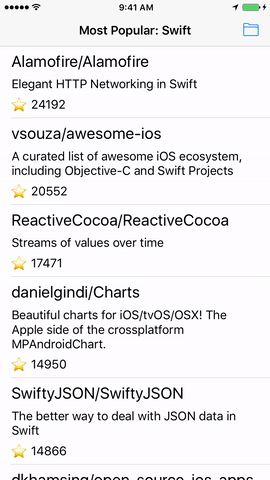

# Coordinator-MVVM-Rx-Example

This simple app displays a list of the most starred repositories on GitHub by a language. User can choose a language to filter repositories and select repository in the list to open it in the `SFSafariViewController`.

App is written with Xcode 8 and Swift 3.

**Demo:** 

*Please, note that this example may violate some rules of the clean code. Main goal of this repository is to show in the most understandable and simple way how we setup architecture out of MVVM, Coordinators & RxSwift.*
